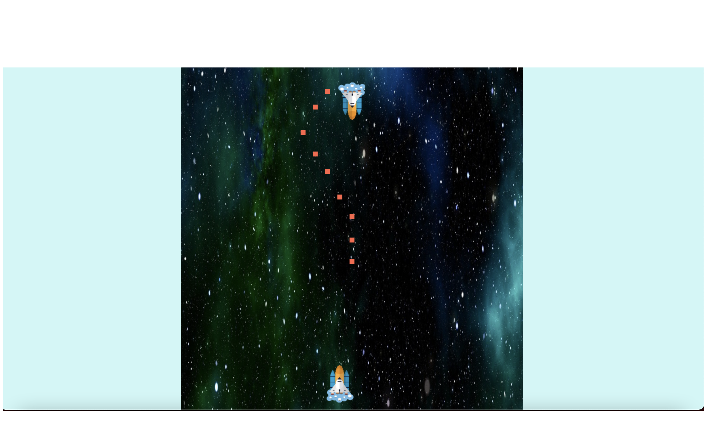

# Game

## 간단한 소개

타입스크립트를 익히고 좋은 어플리케이션 구조에 대해 고민하고 연습하기 위해 시작한 프로젝트로, 추억의 게임 갤러그를 흉내냈습니다.(미완성)

## 쓰인 기술

Typescript, CSS, HTML

## 기간

약 2달~ing

## 구현한 것들

- canvas API를 이용하여 우주선을 적절한 위치에 위치시켰다.
- canvas API를 이용하여 방향키를 누르면 우주선이 움직이도록 했다.
- requestAnimationFrame을 이용하여 배경이 움직이도록 했다.
- canvas API와 requestAnimationFrame을 이용하여 스페이스바를 누르면 공격이 나가도록 했다.

(실행 화면)

## 앞으로 해야할 것
- 적군의 우주선을 랜덤한 위치로 움직이는 것.
- 적군의 우주선이 공격하게 하는 것.
- 체력 요소를 만드는 것
- 게임 오버 화면을 만드는 것
